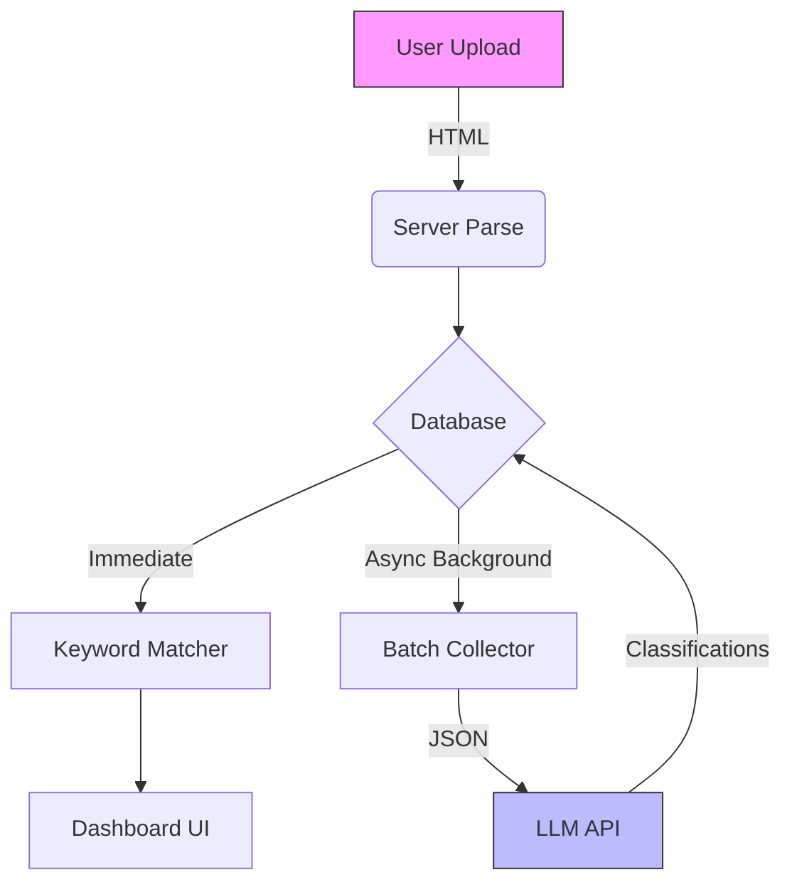

# System Workflows

## Bookmark Ingestion & Categorization Pipeline

This document outlines the "Fast then Smart" architecture designed to handle large imports without blocking the user interface.

### 1. ⚡ Fast Path (Synchronous)
*Goal: Get the user to the dashboard as quickly as possible.*

1.  **Ingest**: User uploads Netscape HTML file via `POST /upload`.
2.  **Scrape**: Playwright/Cheerio extracts Title, Description, and Domain.
3.  **Persist**: Bookmarks are saved to `links` and `user_bookmarks` tables immediately.
4.  **Local Sort**: The v0.2 Keyword Matcher runs locally.
    *   *Result*: Items are roughly sorted into broad categories (Dev, Media, News).
5.  **Render**: User sees the Dashboard within seconds.

---

### 2. 🧠 Smart Path (Asynchronous)
*Goal: Refine the organization using AI for high prescision.*

1.  **Trigger**: Background cron job OR Manual "AI Organize" button.
2.  **Select**: Query the DB for items where `category = 'Unorganized'` or `confidence < 0.5`.
3.  **Batch**: Group items into batches of 50 to minimize API round-trips.
4.  **LLM Processing**:
    *   Send logic: `Title + Description` -> LLM (e.g., Gemini-1.5-Flash).
    *   Request: "Classify into specific sub-categories and generation tags."
5.  **Update**:
    *   Write new `category`, `subcategory`, and `tags` to the DB.
    *   Frontend polling (or WebSocket) updates the UI live.
    *   *Result*: "Junk Drawer" folder shrinks; specific folders (e.g. "Vegan Recipes") appear.

### Diagram

